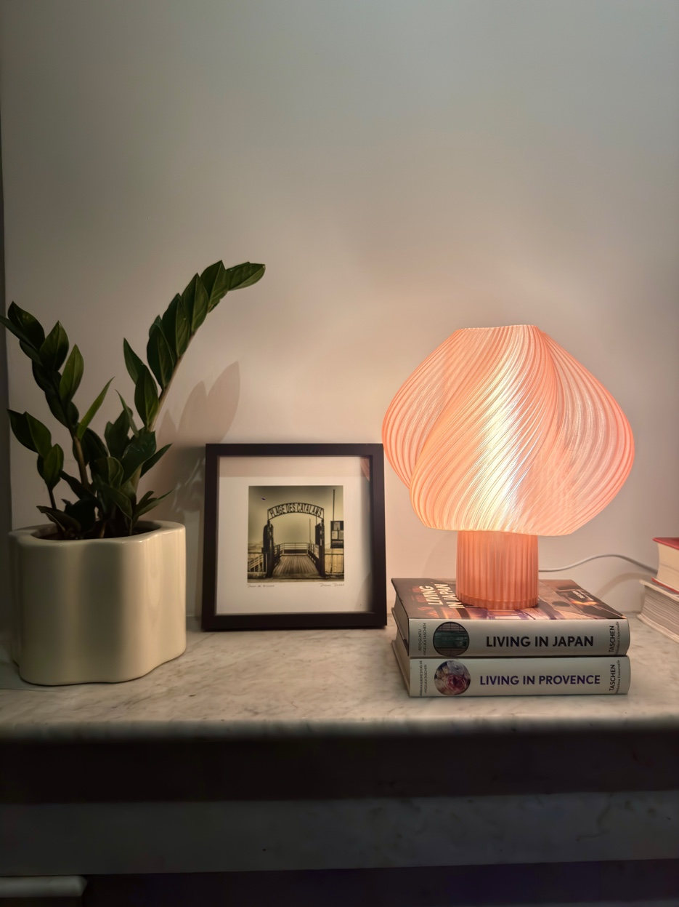

# Lumina - Lampes Design Imprimées en 3D

Site e-commerce minimaliste et luxueux pour une marque de lampes design imprimées en 3D à Marseille.



## ✨ Caractéristiques

- **Design luxe minimaliste** - Palette neutre, typographie élégante, beaucoup d'espace blanc
- **E-commerce prêt** - Panier fonctionnel, pages produits, récapitulatif de commande
- **Next.js 14** - App Router, Server Components, optimisation des images
- **TypeScript** - Code typé et maintenable
- **Tailwind CSS** - Design system cohérent et personnalisé
- **Responsive** - Mobile-first, adapté à tous les écrans
- **SEO optimisé** - Métadonnées, structure sémantique, Open Graph

## 🚀 Déploiement

### Prérequis

- Node.js 18+ 
- npm ou yarn
- Compte GitHub
- Compte Vercel
- **Compte Stripe** (pour les paiements)

### Configuration Stripe

1. **Récupérer vos clés API Stripe**
   - Aller sur [dashboard.stripe.com/apikeys](https://dashboard.stripe.com/apikeys)
   - Copier la clé publique (`pk_test_...` ou `pk_live_...`)
   - Copier la clé secrète (`sk_test_...` ou `sk_live_...`)

2. **Configurer les variables d'environnement**
   ```bash
   # Créer le fichier .env.local
   cp .env.example .env.local
   
   # Éditer et ajouter vos clés
   NEXT_PUBLIC_STRIPE_PUBLISHABLE_KEY=pk_test_votre_cle
   STRIPE_SECRET_KEY=sk_test_votre_cle_secrete
   ```

3. **Tester le paiement**
   - Utiliser la carte de test : `4242 4242 4242 4242`
   - Date d'expiration : n'importe quelle date future
   - CVC : n'importe quel code à 3 chiffres

### Étapes de déploiement

1. **Installer les dépendances**
   ```bash
   npm install
   ```

2. **Tester en local**
   ```bash
   npm run dev
   ```
   Ouvrir [http://localhost:3000](http://localhost:3000)

3. **Initialiser Git et pousser vers GitHub**
   ```bash
   git init
   git add .
   git commit -m "Initial commit - Lumina e-commerce"
   git branch -M main
   git remote add origin https://github.com/VOTRE_USERNAME/lumina-lamps.git
   git push -u origin main
   ```

4. **Déployer sur Vercel**
   - Aller sur [vercel.com](https://vercel.com)
   - Importer le projet depuis GitHub
   - **Important** : Ajouter les variables d'environnement Stripe :
     - `NEXT_PUBLIC_STRIPE_PUBLISHABLE_KEY` = votre clé publique
     - `STRIPE_SECRET_KEY` = votre clé secrète
   - Cliquer "Deploy"

## 📁 Structure du projet

```
lumina-lamps/
├── public/
│   └── images/           # Photos des lampes
├── src/
│   ├── app/              # Pages (App Router)
│   │   ├── collection/   # Page collection
│   │   ├── product/[slug]/ # Pages produits dynamiques
│   │   ├── styles/       # Page styles/catégories
│   │   ├── panier/       # Page panier
│   │   ├── contact/      # Page contact
│   │   ├── globals.css   # Styles globaux
│   │   ├── layout.tsx    # Layout principal
│   │   └── page.tsx      # Page d'accueil
│   ├── components/       # Composants réutilisables
│   │   ├── Header.tsx
│   │   ├── Footer.tsx
│   │   ├── CartDrawer.tsx
│   │   └── ProductCard.tsx
│   ├── context/          # Contextes React
│   │   └── CartContext.tsx
│   └── data/             # Données produits
│       └── products.ts
├── tailwind.config.ts    # Configuration Tailwind
├── next.config.js        # Configuration Next.js
└── package.json
```

## 🎨 Personnalisation

### Modifier les produits

Éditer `src/data/products.ts` pour ajouter/modifier les lampes :

```typescript
{
  id: 'unique-id',
  slug: 'url-slug',
  name: 'Nom',
  subtitle: 'Variante',
  price: 289,
  description: 'Description courte',
  longDescription: 'Description détaillée...',
  style: 'Nom du style',
  styleSlug: 'slug-style',
  color: 'Nom de la couleur',
  colorHex: '#HEXCODE',
  images: {
    off: '/images/lampe-eteinte.jpeg',
    on: '/images/lampe-allumee.jpeg'
  },
  dimensions: { height: '28 cm', diameter: '22 cm' },
  material: 'PLA premium translucide',
  inStock: true,
  featured: true
}
```

### Modifier les couleurs

Éditer `tailwind.config.ts` pour ajuster la palette :

```typescript
colors: {
  'ivory': '#FDFBF7',
  'cream': '#F8F6F1',
  'sand': '#EBE6DC',
  'stone': '#9A9590',
  'charcoal': '#2C2826',
  'ink': '#1A1816',
}
```

## 🔧 Scripts disponibles

```bash
npm run dev      # Serveur de développement
npm run build    # Build de production
npm run start    # Serveur de production
npm run lint     # Vérification du code
```

## 📝 Prochaines étapes

Le paiement Stripe est maintenant intégré ! Pour un site e-commerce encore plus complet :

1. **Webhooks Stripe** - Recevoir les notifications de paiement en temps réel
2. **Email transactionnel** - Confirmation de commande automatique (SendGrid, Resend...)
3. **Gestion des stocks** - Suivi automatique des quantités
4. **CMS** - Gestion des produits sans code (Sanity, Strapi, Contentful...)
5. **Analytics** - Suivi des conversions (Vercel Analytics, Plausible...)
6. **Passer en production** - Remplacer les clés test par les clés live

## 📄 Licence

Tous droits réservés © Lumina 2024

---

Créé avec ❤️ à Marseille
